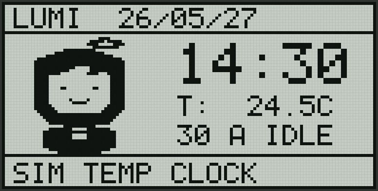

# LUMI.BUDDY 8051

[](LICENSE)
[](docs/hardware.zh.md)
[](docs/hardware.zh.md)

**[中文课程报告 →](docs/final-report.zh.md)**

A pixel-art temperature clock HUD for 8051/STC89C52 course boards with LCD12864 (ST7920 graphic mode). Built as an enhanced Experiment 8 project that turns a standard character-mode clock demo into a low-resource graphical desktop buddy.



## Highlights

- **16-byte scanline buffer** — no 1024-byte framebuffer needed; fits the 8051's 256-byte internal RAM.
- **Original pixel avatar** — 7 expression states (idle, sleep, hot, cold, heart, wave, error) rendered at runtime with zero bitmap storage.
- **Dirty-flag partial refresh** — only changed scan-line ranges are rewritten to the LCD, reducing visible flicker.
- **Reserved DS18B20 driver path** — one `#define` switch keeps the simulated demo separate from the real sensor path.
- **BCD validation** — DS1302 readings are sanity-checked before display; auto-fallback to preset time on corrupt data.

## Hardware

| Module | Pins |
| --- | --- |
| LCD12864 data | `DB0-DB7 = P0.0-P0.7` |
| LCD12864 control | `RS=P2.6` `RW=P2.5` `E=P2.7` `PSB=P3.2` |
| DS1302 RTC | `IO=P3.4` `RST=P3.5` `CLK=P3.6` |
| DS18B20 temp | Reserved — handout uses `DQ=P3.7` |

See [docs/hardware.zh.md](docs/hardware.zh.md) for port-conflict notes and the reserved temperature interface.

## Build & Flash

Pre-built firmware: [`firmware/lumi_exp08_reserved.hex`](firmware/lumi_exp08_reserved.hex)

To rebuild with Keil C51 (Windows, default path `C:\Keil_v5\C51\BIN`):

```powershell
powershell -ExecutionPolicy Bypass -File scripts/build-keil.ps1
```

Flash with STC-ISP or the board's companion download tool. See [docs/build-and-flash.zh.md](docs/build-and-flash.zh.md) for details.

## Documents

| Document | Description |
| --- | --- |
| [Course Report](docs/final-report.zh.md) | Full report: experiments 1-7 summaries, experiment 8 design specification, flowchart, result photos |
| [Architecture Notes](docs/architecture.zh.md) | Rendering model, hardware boundary, and future RTOS/ROS expansion path |
| [Hardware Notes](docs/hardware.zh.md) | Wiring table, temperature reservation, button reservation |
| [Build & Flash](docs/build-and-flash.zh.md) | Keil rebuild steps and DS1302 time calibration |
| [Roadmap](ROADMAP.md) | Open-source evolution plan from course demo to modern MCU status buddy |

## Project Vision

`LUMI.BUDDY` is intentionally more than a clock demo. It is a tiny 8051 prototype of a desktop status buddy:

| Now | Future |
| --- | --- |
| Time, simulated temperature, avatar state, mode text | Task cards, AI handoff status, data-lake index, ROS 2 metrics |
| 8051 + LCD12864 monochrome | ESP32-S3 / SiFli + color screen, FreeRTOS + LVGL, BLE/Wi-Fi |

Related inspiration includes Anthropic's open-source [**Claude Desktop Buddy**](https://github.com/anthropics/claude-desktop-buddy), especially the idea of turning software state into a small physical display. This project reworks that interaction pattern for an 8051 course board with an original monochrome pixel character and a scanline renderer; no upstream code or assets are included.

## Repository Boundary

This repository does **not** include course handout PDFs, private notes, or personal evidence files. Those materials have separate ownership or privacy constraints.

## License

Apache License 2.0 — see [LICENSE](LICENSE) and [NOTICE](NOTICE).
