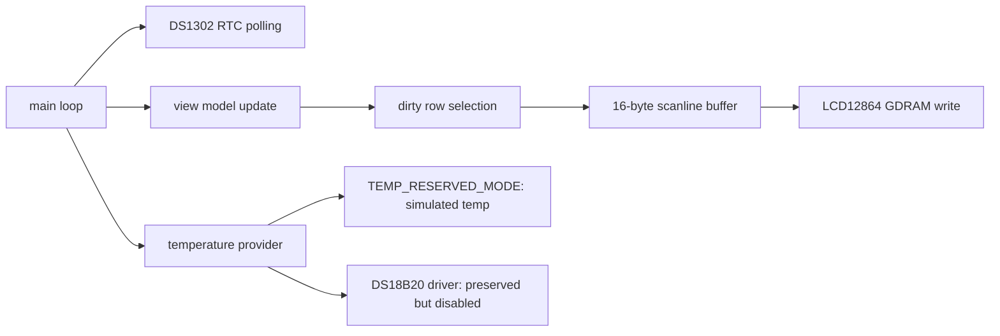
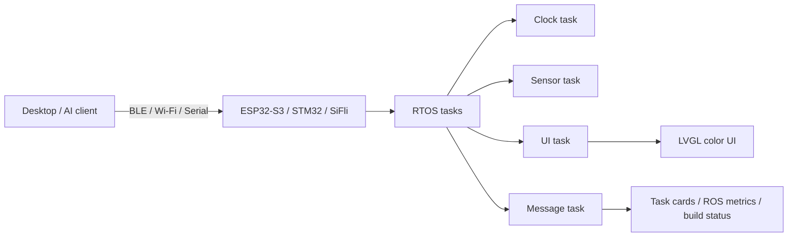

# 架构说明

这个项目的起点是把实验八从一个传统的字符式温度时钟改造成资源受限条件下的图形 HUD。说实话，核心约束挺硬的：8051 内部 RAM 极小，LCD12864 写入速度慢，DS1302 和 DS18B20 又对时序要求很严格。所以架构上的目标不是往上堆功能，而是先把界面、时钟和预留传感器链路在"显示稳定"这个前提下组织清楚。

## 当前 8051 架构

程序里我没有分配整屏的 framebuffer。每次刷新的时候只准备当前扫描行对应的 16 字节缓冲，然后直接写进 LCD12864。这个做法把显示缓冲从 1024 字节压到了 16 字节，算是真正适配了 8051 的内存限制。

## 显示管线

1. `render_rows(top, bottom)` 决定本次需要刷新哪些扫描行。
2. 每一行先把 `line_buf[16]` 清空。
3. 根据行号依次叠加边框、文本、状态栏和像素头像。
4. `lcd_write_scanline(y)` 把这 16 字节写进 LCD12864 的 GDRAM。

代价当然是每次都得重新算一遍像素，但好处是 RAM 占用非常低，也避免了程序里塞一大堆位图数组变成素材搬运工。

## 传感器边界

温度模块被我刻意拆成了"数据提供者"的形式：

- `TEMP_RESERVED_MODE = 1`：不访问 DS18B20 总线，直接显示模拟温度。
- `TEMP_RESERVED_MODE = 0`：启用保留的 DS18B20 读取流程。

为什么要这样做呢——调试的时候发现课程板上 `P3.7/DQ` 在拔掉 DS18B20 之后依然读到的是低电平。公开版本不应该把模拟值包装成实测值，所以我明确标注这是预留接口。

## 按键边界

当前版本没有扫描板载按键。原因有两个：课程资料没有给出稳定的按键映射，而且 LCD12864 的 `PSB` 已经占用了 `P3.2`。按键功能在文档里保留为未来扩展，计划用于表情切换、手动刷新和模式切换。

## 未来平台架构

如果将来迁移到 ESP32-S3、STM32 或者思澈 SiFli 上，就可以把现在的手写状态机拆成多个 RTOS 任务，用 LVGL 来管理彩色界面。到那个时候，LUMI.BUDDY 就能从一个"课程实验界面"升级为"桌面/实验室状态面板"——显示任务卡片、AI 接续状态、资料湖入口、ROS 2 延迟和 QoS 指标之类的信息。

## 设计原则

- 先稳定，再好看：显示正常和时序稳定永远优先于动画复杂度。
- 只声明真实完成的功能：温度和按键在当前版本都标注为预留，不搞虚的。
- 保持低资源意识：8051 版本不用全屏 framebuffer，不引入大型位图。
- 保持可迁移：界面模型、温度数据提供者、渲染函数尽量分层，以后移植的时候不至于推倒重来。
