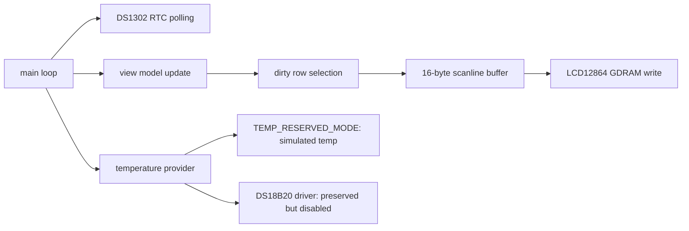
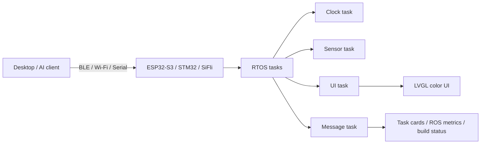

# 架构说明

本项目把实验八从传统字符式温度时钟改造成一个资源受限的图形 HUD。核心约束是：8051 内部 RAM 极小，LCD12864 写入较慢，DS1302/DS18B20 又需要严格时序。因此架构目标不是堆功能，而是在稳定显示的前提下把界面、时钟和预留传感器链路组织清楚。

## 当前 8051 架构

程序没有分配整屏 framebuffer。每次刷新时只准备当前扫描行的 16 字节缓冲，然后把这一行写入 LCD12864。这样做能把显示缓冲从 1024 字节降到 16 字节，适配 8051 的内存限制。

## 显示管线

1. `render_rows(top, bottom)` 决定本次要刷新的扫描行范围。
2. 每一行先清空 `line_buf[16]`。
3. 根据行号叠加边框、文本、状态栏和像素头像。
4. `lcd_write_scanline(y)` 将 16 字节写入 LCD12864 GDRAM。

这种方式的代价是每次都要重新计算像素，但收益是 RAM 占用极低，也避免了大位图数组把程序变成素材搬运。

## 传感器边界

温度模块被刻意拆成“数据提供者”：

- `TEMP_RESERVED_MODE = 1`：不访问 DS18B20 总线，显示模拟温度。
- `TEMP_RESERVED_MODE = 0`：启用保留的 DS18B20 读取流程。

这样处理是因为调试中发现课程板 `P3.7/DQ` 在拔掉 DS18B20 后仍读低电平。公开版本不会把模拟值包装成实测值，而是明确写作预留接口。

## 按键边界

当前版本不扫描板载按键。原因是课程资料没有给出稳定按键映射，并且 LCD12864 的 `PSB` 已占用 `P3.2`。按键功能在文档中保留为未来扩展：表情切换、手动刷新、模式切换。

## 未来平台架构

迁移到 ESP32-S3、STM32 或思澈 SiFli 后，可以把当前手写状态机拆成多个 RTOS 任务，并使用 LVGL 管理彩色界面。此时 LUMI.BUDDY 可以从“课程实验界面”升级为“桌面/实验室状态面板”：显示任务卡片、AI 接续状态、资料湖入口、ROS 2 延迟和 QoS 指标。

## 设计原则

- 先稳定，再好看：显示正常和时序稳定优先于动画复杂度。
- 只声明真实完成的功能：温度和按键在当前版本均标注为预留。
- 保持低资源意识：8051 版本不使用全屏 framebuffer，不引入大型位图。
- 保持可迁移：界面模型、温度数据提供者、渲染函数尽量分层，方便未来移植。
