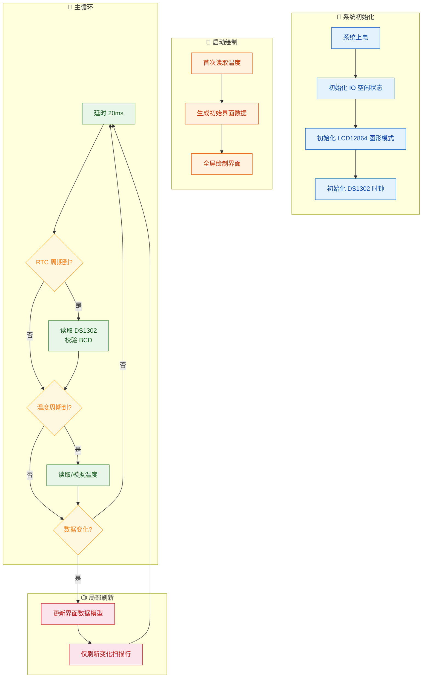

# 液晶驱动技术实验课程报告

> **项目名称：** LUMI.BUDDY 8051 — 基于 LCD12864 的像素风温度时钟界面
>
> **硬件平台：** 普中 51 / STC89C52 课程实验箱，LCD12864 图形点阵液晶，DS1302 时钟芯片，DS18B20 温度传感器
>
> **开源协议：** Apache License 2.0
>
> **代码仓库：** https://github.com/tianbingzhuo/lumi-buddy-8051

---

## 一、前七个实验简短总结

### 实验一：静态数码管显示实验

本实验使用单片机 P0 口输出段码，驱动单个数码管显示固定数字。通过手动设置 IO 口电平控制数码管各段的亮灭，实现了共阴/共阳数码管的静态显示。该实验建立了"数据口输出什么、屏幕就显示什么"的基本认知，是后续所有显示器件驱动的思想起点。

*图：开发板数码管区域全貌，数码管显示全段测试态。*

### 实验二：动态数码管显示实验

本实验在静态驱动基础上引入位选扫描机制：P0 口输出段码，P2.2–P2.4 经 74HC138 译码器完成位选，按"选位 → 送段码 → 延时 → 消隐 → 切下一位"的循环依次点亮多位数码管。利用人眼视觉暂留，多位数码管在宏观上呈现同时显示的效果。该实验体现了分时复用和周期刷新的思想，对后续 LCD 局部刷新策略有直接启发。

*图：点阵 LED 与数码管同时工作的开发板状态。*

### 实验三：点阵 LED 显示实验

本实验使用 P0 口控制点阵列数据，P3.4–P3.6 驱动 74HC595 完成行扫描，在 8×8 点阵上形成稳定图案。点阵 LED 需要持续刷新行列数据才能维持显示，强调了图形显示中扫描时序与数据组织的核心地位。值得注意的是，P3.4–P3.6 在实验七中会用于 DS1302 通信，这提示综合设计中必须关注端口复用冲突问题。

### 实验四：1602 字符型液晶显示模块实验

本实验使用 LCD1602 字符液晶，接线为 DB0–DB7=P0、RS=P2.6、RW=P2.5、E=P2.7。程序通过"写命令"与"写数据"两类操作完成初始化、光标定位和字符输出。LCD1602 的并口写入时序（RS/RW/E 配合、建立时间与保持时间）与实验五 LCD12864 高度相似，为后续 12864 驱动程序的编写提供了直接基础。

*图：LCD1602 显示自定义字符内容。*

### 实验五：12864 图形点阵液晶显示模块实验

本实验使用 LCD12864 图形点阵液晶，接线为 DB0–DB7=P0、RS=P2.6、RW=P2.5、E=P2.7、PSB=P3.2。与 LCD1602 只能显示字符不同，LCD12864 在图形模式下可以直接操作 128×64 像素的显存，绘制任意图案、文字和边框。该实验为最终综合界面中的边框绘制、头像渲染、自定义字模和分区布局提供了核心技术基础。

### 实验六：基于 1602 字符型 LCD 的温度显示实验

本实验使用 DS18B20 单总线温度传感器采集环境温度，并通过 LCD1602 显示测量结果。DS18B20 通信流程包括：主机拉低复位 → 等待存在脉冲 → 发送跳过 ROM 命令（0xCC）→ 发送温度转换命令（0x44）→ 等待转换完成 → 重新复位后读取暂存器（0xBE）→ 解析 16 位温度数据。该实验为综合设计中的温度采集链路提供了完整的传感器通信流程和时序参考。

*图：LCD1602 显示 DS18B20 采集到的实时温度值。*

### 实验七：基于 1602 字符型 LCD 的时钟显示实验

本实验使用 DS1302 实时时钟芯片读取年、月、日、星期、时、分、秒，并在 LCD1602 上显示。DS1302 采用三线串行通信（IO=P3.4、RST=P3.5、CLK=P3.6），数据以 BCD 格式存储。读写操作通过地址字节区分，每次传输 8 位，先低位后高位。该实验为最终综合设计中的实时时钟模块提供了核心驱动思路和 BCD 校验方法。

*图：LCD1602 显示 DS1302 读取的日期与时间信息。*

---

## 二、实验八设计说明书

### 2.1 设计思路

实验八要求将前面实验中的 LCD12864 图形显示、DS1302 时钟和 DS18B20 温度接口综合到一个完整的界面中。本设计没有采用常见的纯字符显示方案，而是将 LCD12864 设置为图形模式，设计了一个名为 **LUMI.BUDDY** 的个性化桌面小界面。

设计灵感来自嵌入式设备中常见的 HUD（Head-Up Display）风格：在有限屏幕空间内，将关键信息以分区方式集中呈现。界面左侧放置一个原创单色像素角色作为状态指示，右侧显示日期、时间、温度和系统状态，整体布局用边框和分隔线划分层级，形成类似仪表盘的信息密度。

之所以选择图形模式而非字符模式，有三个原因。第一，图形模式可以绘制自定义像素头像，赋予界面辨识度。第二，图形模式允许自由定位文字位置，实现"大字体时间 + 小字体温度"的层级布局。第三，8051 的 RAM 有限（仅 256 字节内部 RAM），图形模式迫使开发者思考内存管理策略——本设计使用 16 字节扫描线缓冲代替 1024 字节整屏帧缓存，将内存占用降低了 98%。

### 2.2 硬件端口设计

| 模块 | 单片机引脚 | 说明 |
| --- | --- | --- |
| LCD12864 数据口 | `DB0–DB7 = P0.0–P0.7` | 8 位并口数据传输 |
| LCD12864 控制口 | `RS=P2.6`, `RW=P2.5`, `E=P2.7` | 寄存器选择、读写选择、使能信号 |
| LCD12864 并口选择 | `PSB=P3.2` | 高电平选择并口模式 |
| DS1302 时钟 | `IO=P3.4`, `RST=P3.5`, `CLK=P3.6` | 三线串行通信 |
| DS18B20 温度 | `DQ=P3.7`（保留接口） | 单总线接口，当前版本使用模拟温度 |

关于温度接口的说明：在实训板调试过程中，P3.7/DQ 线路在拔掉 DS18B20 后仍持续输出低电平，导致温度传感器无法正常通信。因此，当前提交版本启用了温度预留模式（`TEMP_RESERVED_MODE`）：程序不访问异常的 DS18B20 总线，而是在温度区域显示根据秒数生成的模拟温度值，用于展示界面效果。DS18B20 的完整读取代码仍保留在源码中，硬件恢复后只需关闭预留宏即可切换为实测温度。

### 2.3 功能介绍

#### 功能一：LCD12864 图形界面渲染

程序将 LCD12864 初始化为并口图形模式（指令序列 `0x30 → 0x0C → 0x01 → 0x34 → 0x36`），通过逐扫描线写入的方式绘制完整界面。每帧渲染流程为：清空 16 字节行缓冲 → 按当前扫描行号依次绘制边框、文字、头像 → 将行缓冲写入 LCD GDRAM 对应地址。这种扫描线渲染方式不需要分配 1024 字节帧缓存，完全适配 8051 的有限 RAM 环境。

界面布局自上而下分为四个区域：顶栏（日期信息）、主显示区（左侧头像 + 右侧大字体时间）、信息区（温度 + 状态栏）、底栏（模式标识）。区域之间使用全宽水平分隔线划分，两侧使用垂直边框线包围，形成清晰的视觉层级。

#### 功能二：DS1302 实时时钟显示

程序以约 200ms 的周期轮询 DS1302 时钟寄存器，读取 7 个字节的 BCD 时间数据后进行合法性校验。校验逻辑包括：各字段的 BCD 高低位不超过 9、秒/分不超过 59、时不超过 23、日不超过 31 且大于 0、月不超过 12 且大于 0。若读数异常（如芯片首次上电数据无效），程序自动写入预设初始时间。

时间数据的显示分两处：顶栏以 `YY/MM/DD` 格式显示日期（1 倍缩放），主显示区以 `HH:MM` 格式显示时间（2 倍缩放，字符高度 14 像素），状态栏额外显示秒数。

#### 功能三：温度预留与模拟显示

界面保留 `T: xx.xC` 温度显示区域，温度值以十分之一度为单位的整数存储（如 24.5°C 存储为 `245`），避免浮点运算和 `sprintf` 的开销。当前版本启用预留模式时，模拟温度根据秒数在 24.0°C 附近产生 ±1°C 的三角波变化，既保证界面有动态效果，又不会因访问异常总线导致程序卡死。

当使用实测模式时，DS18B20 驱动执行标准的"复位 → 跳过 ROM → 启动转换 → 等待 750ms → 复位 → 读暂存器"流程，读取 16 位原始温度数据后通过整数运算转换为十分之一度：`result = (magnitude * 10 + 8) / 16`，其中 `+8` 实现四舍五入。

#### 功能四：个性化像素头像与表情状态

左侧头像为原创单色像素风角色 LUMI.BUDDY，由程序实时绘制而非存储位图。头像由以下部分构成：发带与天线装饰（第 0–3 行）、头发轮廓（第 4–29 行，使用先填充后裁切的方式形成圆润轮廓）、刘海（第 10–12 行）、身体与领结（第 29–39 行）。整个头像占用约 40 行扫描线，宽度约 30 像素，完全通过 `avatar_span`（填充）和 `avatar_cut`（裁切）两个基本操作组合而成。

头像支持 7 种表情状态，根据时间或温度自动切换：

| 状态 | 触发条件 | 表情特征 |
| --- | --- | --- |
| IDLE | 默认状态 | 圆点眼睛 + 微笑嘴巴 |
| SLEEP | 23:00–07:00 | 横线闭眼 + "Z" 气泡 |
| HOT | 温度 ≥ 30.0°C | 方块眼 + 汗滴 |
| COLD | 温度 ≤ 15.0°C | 正常脸 + 两侧发抖线 |
| HEART | 温度无效时轮换 | 心形眼 + 大嘴巴 |
| WAVE | 温度无效时轮换 | 正常脸 + 挥手线条 |
| ERR | 温度异常 | 方块眼 + 感叹号 |

#### 功能五：局部刷新策略

主循环采用脏标记（dirty flag）与分区刷新策略。每次 RTC 轮询或温度更新后，程序对比新旧值，仅将发生变化的界面区域标记为需要刷新。刷新时调用 `render_rows(top, bottom)` 只重绘指定扫描行范围，而非全部 64 行。例如，仅分钟变化时只需重绘时间区域的 14 行（第 14–27 行），大幅减少了 LCD 写入耗时和可感知的屏幕闪烁。

### 2.4 关键函数说明

#### `lcd_write_scanline(u8 y)` — 扫描线写入

将 16 字节行缓冲写入 LCD12864 的 GDRAM。函数先发送行地址（`0x80 | y`），再根据 y 是否小于 32 发送左半屏或右半屏的列起始地址（`0x80` 或 `0x88`），最后连续写入 16 字节数据。这是整个图形渲染的底层输出通道。

#### `render_avatar_row(FaceState face, u8 frame, u8 scan_y)` — 头像逐行渲染

根据传入的扫描行号 `scan_y`，计算该行在头像内部的相对行号 `row`，然后依次绘制头发轮廓、面部开口、刘海、身体和当前表情。函数采用"先填充整个轮廓，再裁切面部区域"的方式，避免了复杂的边界计算。表情细节在所有基础结构绘制完成后叠加，确保不破坏头像主体。

#### `font_column(char ch, u8 column)` — 字模列查询

返回字符 `ch` 在指定列 `column`（0–4）的 7 位垂直点阵数据。函数同时支持数字（0–9）、大写字母（A–Z）和少量符号（`:`、`.`、`-`、`/`），所有字模数据存储在 `code` 区（ROM），不占用宝贵的 RAM。

#### `render_text_row(u8 x, u8 y, u8 scale, char *text, u8 scan_y)` — 文字逐行渲染

在指定扫描行上渲染字符串 `text`。参数 `scale` 控制缩放倍数（1 为 5×7 像素原始大小，2 为 10×14 像素放大显示）。函数通过 `(scan_y - y) / scale` 计算当前扫描行对应的字模行号，仅在该行范围内绘制对应像素，与扫描线渲染架构完美配合。

#### `rtc_read_time()` 与 `rtc_data_valid()` — 时钟读取与校验

`rtc_read_time` 依次读取 DS1302 的 7 个时间寄存器（秒、分、时、日、月、周、年），存入 `rtc_raw` 数组后调用 `rtc_data_valid` 进行 BCD 合法性校验。校验通过后，将 BCD 值转换为十进制写入 `clock_now` 结构体。若校验失败，函数返回 0，上层逻辑可决定是否使用上次有效数据。

#### `temp_read_temperature(int *result)` — 温度采集（含预留模式）

该函数通过条件编译实现两种模式。预留模式下，根据秒数生成 24.0°C ± 1.0°C 的三角波模拟值。实测模式下，执行完整的 DS18B20 通信流程：两次复位 + 存在脉冲检测 → 跳过 ROM → 启动转换 → 等待 → 读取暂存器 → 整数运算转换。结果以十分之一度为单位写入 `*result`。

### 2.5 程序流程图

### 2.6 运行结果

以下为与代码输出完全一致的界面模拟预览：

*图：LUMI.BUDDY 界面模拟预览。左侧为原创像素头像，右侧从上到下依次为日期（26/05/27）、大字体时间（14:30）、温度区域（T: 24.5C）和状态栏（30 A IDLE）。顶栏和底栏分别显示标题与模式标识。*

实物运行照片：

*图：LUMI.BUDDY 在课程开发板 LCD12864 上的实物运行效果，可见顶栏日期、大字体时间、左侧像素头像、状态栏与底部模式文字。该照片拍摄于温度接口调试阶段；最终公开固件启用 `TEMP_RESERVED_MODE`，温度区域改为模拟温度显示，不访问异常的 DS18B20 总线。*

### 2.7 实验总结

本设计完成了基于 LCD12864 图形点阵液晶的个性化温度时钟界面，在 8051 有限资源下实现了以下功能：图形模式界面渲染、DS1302 实时时钟显示（含 BCD 校验和异常回退）、温度采集接口预留与模拟显示、原创像素头像与 7 种表情状态、脏标记驱动的局部刷新策略。

在技术实现层面，本设计的核心特点有三个。第一，采用 16 字节扫描线缓冲代替 1024 字节帧缓存，将 RAM 占用降低约 98%，使 8051 的 256 字节内部 RAM 能够同时容纳程序变量和显示缓冲。第二，所有文字和图案均通过程序实时绘制，不依赖大容量位图数组，节省了宝贵的 ROM 空间。第三，条件编译（`TEMP_RESERVED_MODE`）提供了温度实测与模拟两种模式的无缝切换，保证了硬件异常时界面演示的完整性。

实验过程中遇到的主要问题是 DS18B20 温度传感器的 P3.7/DQ 线路在实训板上持续输出低电平，导致单总线通信无法完成。对此的处理策略是：在代码中保留完整的 DS18B20 驱动，但通过宏开关切换到模拟温度模式，既避免了硬件异常影响最终展示效果，也为后续硬件修复后的快速恢复预留了接口。

---

## 三、后续展望：从 8051 实验箱到现代嵌入式平台

### 3.1 8051 的教学价值与工程天花板

传统 8051 是一个非常优秀的底层时序教学平台：手动操作 IO 口电平、逐字节编写总线协议、用移位和掩位完成 BCD 运算——这些训练让开发者对硬件行为建立起直觉。但坦率地说，当项目从"点亮一个数码管"发展到"在图形屏上渲染像素头像 + 时钟 + 温度 + 表情状态"时，8051 的资源瓶颈已经非常明显：256 字节内部 RAM 迫使开发者用扫描线缓冲代替帧缓存，没有 DMA 意味着每次 LCD 写入都要 CPU 逐字节搬运，没有 RTOS 意味着所有"并发"逻辑都靠手动状态机调度。在工具链层面，8051 生态也缺乏现代嵌入式语言的支持——例如 Rust 的嵌入式内存安全模型（`no_std` + `embedded-hal`）、类型系统和 zero-cost abstraction 在 Cortex-M 和 RISC-V 平台上已有成熟实践，但在 8051 上并不可用，开发者需要手动管理所有内存和并发状态，这在教学上有其价值，但在工程实践中容易引入难以调试的时序问题。

如果继续在这个方向上扩展——比如加入按键菜单、BLE 通信、动画帧序列、多页面切换——更现代的 MCU 平台是必然选择。

### 3.2 相关开源原型参考：Claude Desktop Buddy

本设计的交互概念参考了包括 Anthropic 开源 **Claude Desktop Buddy** 在内的小型桌面状态显示项目。该项目使用 M5StickC Plus（基于 ESP32）作为参考硬件，通过小屏幕上的角色状态反馈 AI 会话中的等待、思考、响应、错误等状态。它给本设计最大的启发不是具体代码或素材，而是"把软件状态实体化到一个小硬件屏幕上"这一交互方向。

`LUMI.BUDDY` 在 8051 平台上借鉴了这种"信息显示 + 角色状态 + 物理设备反馈"的思路，并将其压缩为适合 LCD12864 单色屏和有限 RAM 的像素界面。项目没有使用 Claude Desktop Buddy 的源码或图像资产，而是重新设计了原创的单色像素头像与扫描线渲染方式。如果说 Claude Desktop Buddy 是"AI 助手的桌面实体化身"，那么 LUMI.BUDDY 就是这条思路在课程实验箱上的最小可行原型。

### 3.3 平台迁移路线

以下四条迁移路线按"距离 8051 远近"排列：

| 方案 | 代表芯片 | 内核 | 主频 / RAM | 关键优势 | 适合方向 |
| --- | --- | --- | --- | --- | --- |
| STC32G / AI8051 | STC32G12K128 | 32 位 8051 | 36MHz / 128KB SRAM | 指令兼容传统 8051，学习迁移成本最低；支持 CAN、USB、DMA、TFT 彩屏 | 从 8051 平滑过渡，保持教学连续性 |
| STM32 | STM32F411 / STM32H7 | Arm Cortex-M4/M7 | 100–480MHz / 128KB–1MB | HAL/LL 生态成熟，FreeRTOS + LVGL 方案广泛验证 | 通用嵌入式升级，智能手表、工业面板 |
| ESP32-S3 | ESP32-S3-WROOM | Xtensa LX7 双核 | 240MHz / 512KB + PSRAM 8MB | 集成 Wi-Fi + BLE，ESP-IDF + LVGL 9.x 社区活跃，Claude Desktop Buddy 参考平台 | 无线桌面伙伴、AI Agent 硬件终端 |
| 思澈 SiFli | SF32LB55x | Arm Cortex-M33 | 240MHz / 大容量 SRAM | 专为可穿戴优化，超低功耗，SDK 内置 FreeRTOS + LVGL + 图形加速 | 智能手表、AI 眼镜、图形界面穿戴设备 |

如果目标是继续发展 LUMI.BUDDY 为"桌面电子伙伴"或"个人知识系统状态面板"，**ESP32-S3** 是当前性价比最高的选择：Wi-Fi 和 BLE 双模可以同时实现 NTP 网络校时和与上位机通信，LVGL 9.x 可以在彩色触摸屏上实现流畅的动画表情切换和多页面菜单，ESP-IDF + FreeRTOS 的多任务架构可以把时钟、传感器采集、BLE 通信和 UI 渲染分配到独立任务中。此外，ESP32 的 `esp-rs` 项目已提供较完整的 Rust 嵌入式支持（`esp-hal` + `embassy` async runtime），如果未来重写 LUMI.BUDDY，可以考虑用 Rust 替代 C 以获得编译期内存安全和更优雅的异步并发模型——这正是在 8051 上无法实现的开发体验。

如果追求更极致的图形性能和低功耗穿戴形态，思澈 SF32LB55x 系列也是一个值得关注的方向：该芯片面向智能手表和 AI 眼镜场景设计，SDK 提供开箱即用的 RTOS + LVGL + 蓝牙协议栈，在可穿戴领域有差异化的生态定位。

---

*本报告配套源码以 Apache License 2.0 开源。课程实验指导 PDF、私有笔记和个人素材不包含在开源包中。*
