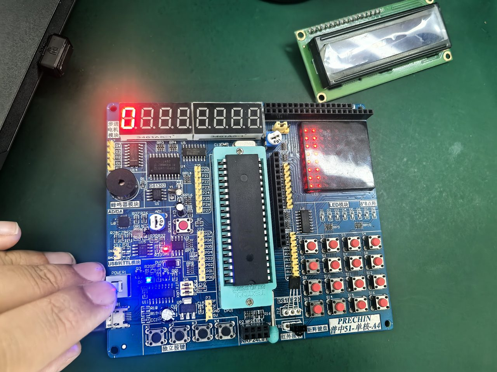
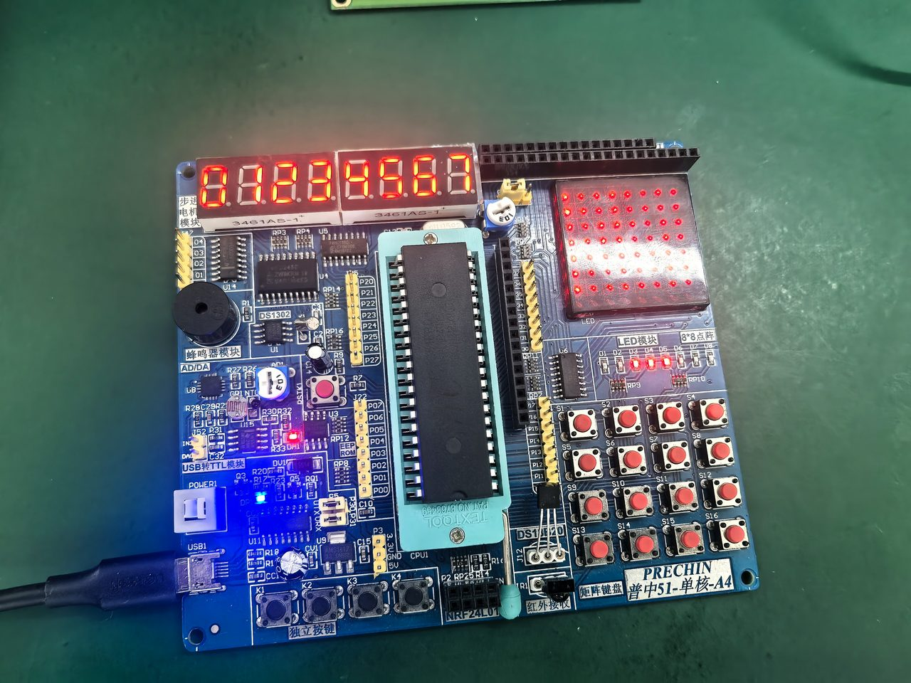
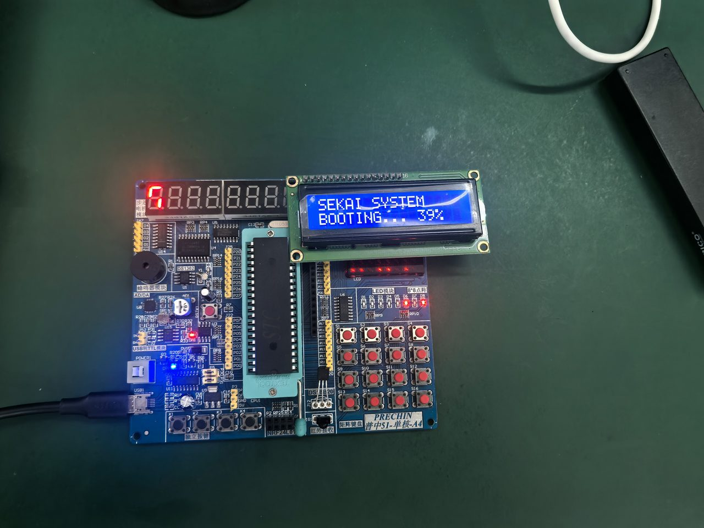
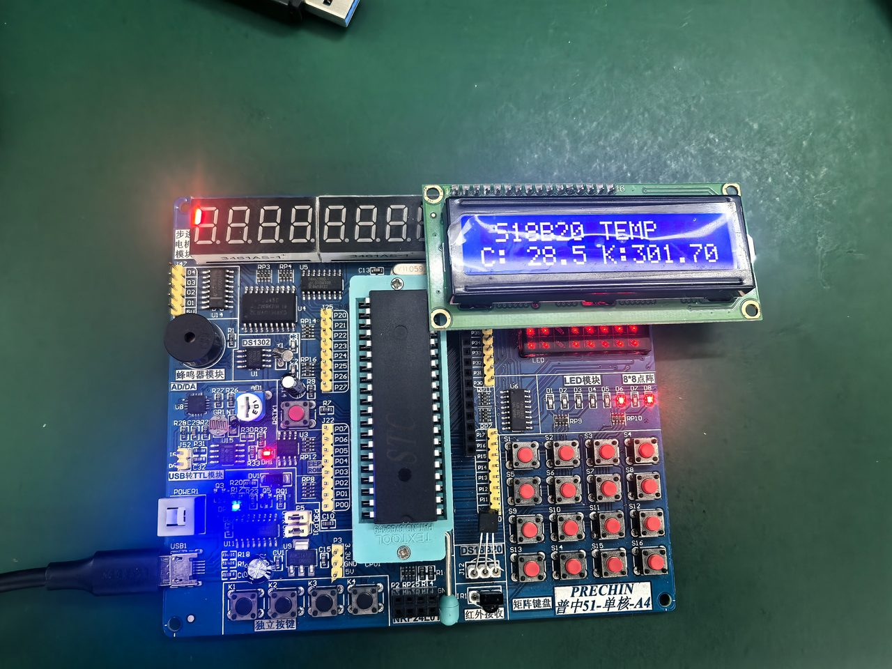
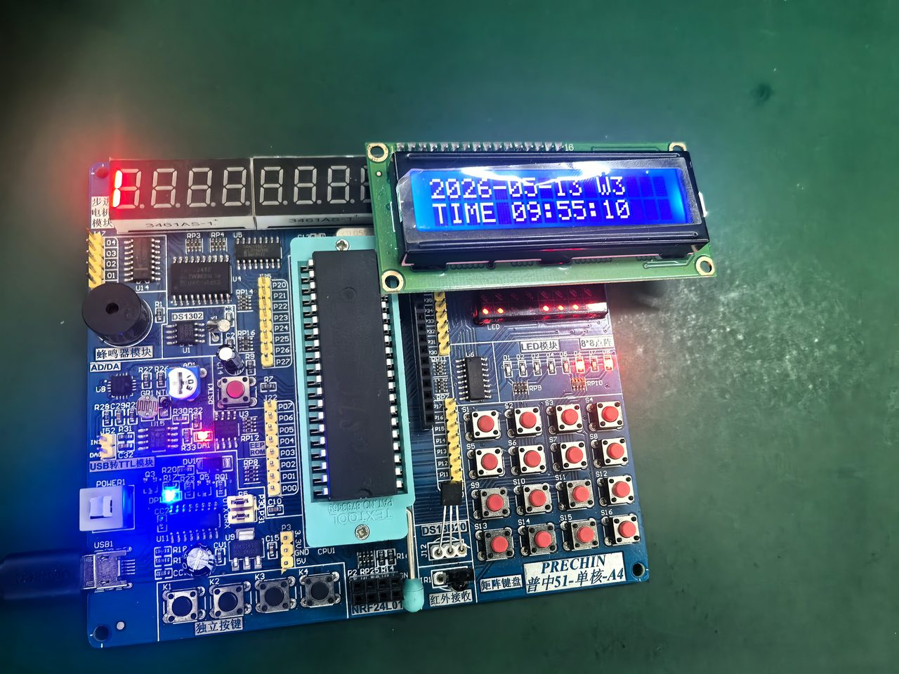
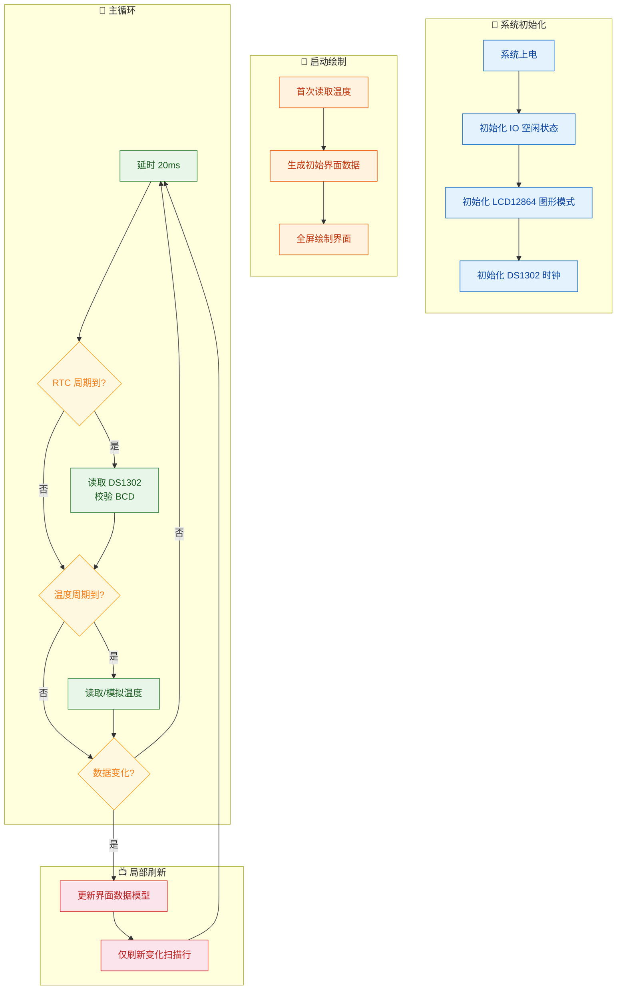
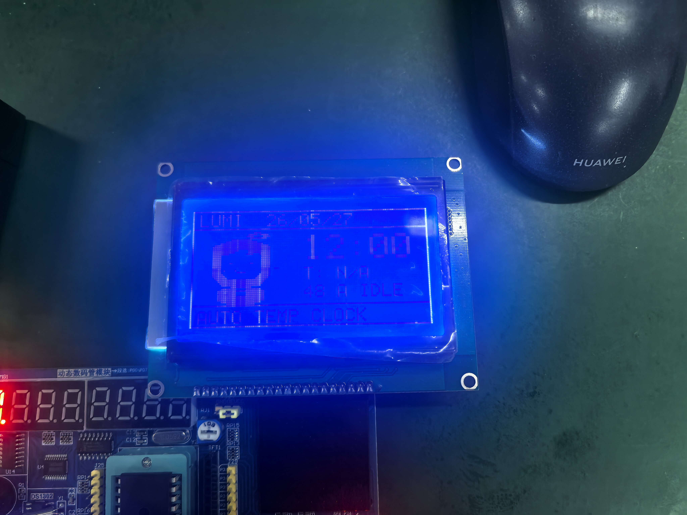

# 液晶驱动技术实验课程报告

> **项目名称：** LUMI.BUDDY 8051 — 基于 LCD12864 的像素风温度时钟界面
>
> **硬件平台：** 普中 51 / STC89C52 课程实验箱，LCD12864 图形点阵液晶，DS1302 时钟芯片，DS18B20 温度传感器
>
> **开源协议：** Apache License 2.0
>
> **代码仓库：** https://github.com/tianbingzhuo/lumi-buddy-8051

---

## 一、前七个实验简短总结

### 实验一：静态数码管显示实验

这个实验用单片机 P0 口输出段码，驱动单个数码管显示一个固定数字。说白了就是手动控制 IO 口电平来决定数码管每一段的亮灭，从而实现共阴或共阳数码管的静态显示。做完这个实验，我对"数据口输出什么、屏幕就显示什么"这件事有了最基本的感觉——后来所有显示器件驱动本质上都是从这个想法延伸出去的。

*图：开发板数码管区域全貌，数码管显示全段测试态。*

### 实验二：动态数码管显示实验

在静态驱动的基础上，这个实验引入了位选扫描机制：P0 口输出段码，P2.2–P2.4 通过 74HC138 译码器完成位选，按照"选位 → 送段码 → 延时 → 消隐 → 切下一位"的循环依次点亮多位数码管。靠人眼的视觉暂留，多个数码管宏观上看起来像是同时在显示。这个实验的核心思想是分时复用和周期刷新，后来我做 LCD 局部刷新的时候，发现思路其实是一脉相承的。

*图：点阵 LED 与数码管同时工作的开发板状态。*

### 实验三：点阵 LED 显示实验

这个实验用 P0 口控制点阵列数据，P3.4–P3.6 驱动 74HC595 完成行扫描，在 8×8 点阵上显示稳定图案。点阵 LED 必须持续刷新行列数据才能维持显示，这让我直观体会到了图形显示中扫描时序和数据组织有多关键。另外值得一提：P3.4–P3.6 这三个引脚在实验七里会被 DS1302 通信复用，这件事提醒我做综合设计的时候一定要留意端口复用冲突。

### 实验四：1602 字符型液晶显示模块实验

这个实验用的是 LCD1602 字符液晶，接线方式为 DB0–DB7=P0、RS=P2.6、RW=P2.5、E=P2.7。程序通过"写命令"和"写数据"两种操作来完成初始化、光标定位和字符输出。LCD1602 的并口写入时序（RS/RW/E 配合、建立时间和保持时间）跟实验五的 LCD12864 非常相似，所以做完这个实验之后写 12864 驱动程序就有了直接的基础。

*图：LCD1602 显示自定义字符内容。*

### 实验五：12864 图形点阵液晶显示模块实验

这个实验使用 LCD12864 图形点阵液晶，接线为 DB0–DB7=P0、RS=P2.6、RW=P2.5、E=P2.7、PSB=P3.2。跟 LCD1602 只能显示字符不同，LCD12864 在图形模式下可以直接操作 128×64 像素的显存，画任意图案、文字和边框。后面综合设计里的边框绘制、头像渲染、自定义字模和分区布局，技术上都来自这个实验打下的底子。

### 实验六：基于 1602 字符型 LCD 的温度显示实验

这个实验用 DS18B20 单总线温度传感器采集环境温度，然后在 LCD1602 上显示出来。DS18B20 的通信流程走了一遍完整链路：主机拉低复位 → 等待存在脉冲 → 发送跳过 ROM 命令（0xCC）→ 发送温度转换命令（0x44）→ 等待转换完成 → 重新复位后读取暂存器（0xBE）→ 解析 16 位温度数据。这段经历给综合设计里的温度采集链路提供了完整的传感器通信流程和时序参考。

*图：LCD1602 显示 DS18B20 采集到的实时温度值。*

### 实验七：基于 1602 字符型 LCD 的时钟显示实验

这个实验用 DS1302 实时时钟芯片读取年、月、日、星期、时、分、秒，在 LCD1602 上显示出来。DS1302 走的是三线串行通信（IO=P3.4、RST=P3.5、CLK=P3.6），数据以 BCD 格式存储。读写操作通过地址字节区分，每次传输 8 位，先低位后高位。这个实验给最终综合设计里的实时时钟模块提供了核心驱动思路和 BCD 校验方法。

*图：LCD1602 显示 DS1302 读取的日期与时间信息。*

---

## 二、实验八设计说明书

### 2.1 设计思路

实验八要求把前面实验中的 LCD12864 图形显示、DS1302 时钟和 DS18B20 温度接口整合到一个完整界面里。我没有走常见的纯字符显示路线，而是把 LCD12864 切到图形模式，做了一个叫 **LUMI.BUDDY** 的个性化桌面小界面。

设计灵感来自嵌入式设备里常见的 HUD（Head-Up Display）风格：屏幕空间就那么大，把关键信息用分区的方式紧凑地呈现出来。界面左边放了一个原创的单色像素角色当状态指示，右边显示日期、时间、温度和系统状态，整体用边框和分隔线划分层级，做出类似仪表盘的信息密度。

为什么选图形模式而不是字符模式？三个原因。第一，图形模式能画自定义像素头像，让界面有辨识度。第二，图形模式可以自由定位文字位置，实现"大字体时间 + 小字体温度"的层级布局。第三，8051 的 RAM 只有 256 字节内部空间，图形模式逼着开发者动脑筋想内存策略——我这个设计用 16 字节扫描线缓冲替代 1024 字节整屏帧缓存，内存占用降了 98%。

### 2.2 硬件端口设计

| 模块 | 单片机引脚 | 说明 |
| --- | --- | --- |
| LCD12864 数据口 | `DB0–DB7 = P0.0–P0.7` | 8 位并口数据传输 |
| LCD12864 控制口 | `RS=P2.6`, `RW=P2.5`, `E=P2.7` | 寄存器选择、读写选择、使能信号 |
| LCD12864 并口选择 | `PSB=P3.2` | 高电平选择并口模式 |
| DS1302 时钟 | `IO=P3.4`, `RST=P3.5`, `CLK=P3.6` | 三线串行通信 |
| DS18B20 温度 | `DQ=P3.7`（保留接口） | 单总线接口，当前版本使用模拟温度 |

关于温度接口得解释一下：在实训板上调试的时候，P3.7/DQ 这条线路在拔掉 DS18B20 之后还是持续输出低电平，温度传感器根本没法正常通信。所以当前提交版本启用了温度预留模式（`TEMP_RESERVED_MODE`）：程序不去访问那条有问题的 DS18B20 总线，而是在温度区域显示根据秒数生成的模拟温度值，用来展示界面效果。DS18B20 的完整读取代码还保留在源码里，等硬件恢复正常了只要关掉预留宏就能切回实测温度。

### 2.3 功能介绍

#### 功能一：LCD12864 图形界面渲染

程序把 LCD12864 初始化为并口图形模式（指令序列 `0x30 → 0x0C → 0x01 → 0x34 → 0x36`），然后逐扫描线写入来绘制完整界面。每一帧的渲染流程是这样的：清空 16 字节行缓冲 → 根据当前扫描行号依次绘制边框、文字、头像 → 把行缓冲写到 LCD GDRAM 的对应地址。这种扫描线渲染方式不需要分配 1024 字节帧缓存，完全适配 8051 有限的 RAM 环境。

界面布局从上到下分四个区域：顶栏（日期信息）、主显示区（左侧头像 + 右侧大字体时间）、信息区（温度 + 状态栏）、底栏（模式标识）。区域之间用全宽水平分隔线划分，两侧有垂直边框线包围，视觉层级很清楚。

#### 功能二：DS1302 实时时钟显示

程序大约每 200ms 轮询一次 DS1302 时钟寄存器，读出来的 7 个字节 BCD 时间数据会先做一轮合法性校验。校验逻辑是这样的：各字段的 BCD 高低位不超过 9、秒和分不超过 59、时不超过 23、日不超过 31 且大于 0、月不超过 12 且大于 0。如果读数异常（比如芯片首次上电数据无效），程序会自动写入预设的初始时间。

时间数据显示分两个地方：顶栏以 `YY/MM/DD` 格式显示日期（1 倍缩放），主显示区以 `HH:MM` 格式显示时间（2 倍缩放，字符高度 14 像素），状态栏还额外显示秒数。

#### 功能三：温度预留与模拟显示

界面保留了 `T: xx.xC` 温度显示区域。温度值以十分之一度为单位的整数来存储（比如 24.5°C 存成 `245`），避开了浮点运算和 `sprintf` 的开销。当前版本启用预留模式时，模拟温度根据秒数在 24.0°C 附近产生 ±1°C 的三角波变化，既让界面有动态效果，又不会因为访问异常总线把程序卡死。

用实测模式的时候，DS18B20 驱动走的是标准流程："复位 → 跳过 ROM → 启动转换 → 等待 750ms → 复位 → 读暂存器"。读到 16 位原始温度数据之后，通过整数运算转成十分之一度：`result = (magnitude * 10 + 8) / 16`，其中 `+8` 起四舍五入的作用。

#### 功能四：个性化像素头像与表情状态

左边的头像是原创单色像素风角色 LUMI.BUDDY，程序实时画出来的，不是存好的位图。头像由这些部分构成：发带与天线装饰（第 0–3 行）、头发轮廓（第 4–29 行，用先填充后裁切的方式做出圆润轮廓）、刘海（第 10–12 行）、身体与领结（第 29–39 行）。整个头像大约占 40 行扫描线，宽度约 30 像素，完全靠 `avatar_span`（填充）和 `avatar_cut`（裁切）这两个基本操作组合而成。

头像支持 7 种表情状态，根据时间或温度自动切换：

| 状态 | 触发条件 | 表情特征 |
| --- | --- | --- |
| IDLE | 默认状态 | 圆点眼睛 + 微笑嘴巴 |
| SLEEP | 23:00–07:00 | 横线闭眼 + "Z" 气泡 |
| HOT | 温度 ≥ 30.0°C | 方块眼 + 汗滴 |
| COLD | 温度 ≤ 15.0°C | 正常脸 + 两侧发抖线 |
| HEART | 温度无效时轮换 | 心形眼 + 大嘴巴 |
| WAVE | 温度无效时轮换 | 正常脸 + 挥手线条 |
| ERR | 温度异常 | 方块眼 + 感叹号 |

#### 功能五：局部刷新策略

主循环用的是脏标记（dirty flag）加分区刷新策略。每次 RTC 轮询或温度更新之后，程序会对比新旧值，只把真正发生变化的区域标记为需要刷新。刷新的时候调用 `render_rows(top, bottom)` 只重绘指定扫描行范围，而不是全部 64 行。举个例子，如果只是分钟变了，那只需要重绘时间区域的 14 行（第 14–27 行），LCD 写入耗时和可感知的屏幕闪烁都大幅减少了。

### 2.4 关键函数说明

#### `lcd_write_scanline(u8 y)` — 扫描线写入

把 16 字节行缓冲写进 LCD12864 的 GDRAM。函数先发一行地址（`0x80 | y`），再根据 y 是否小于 32 来决定发左半屏还是右半屏的列起始地址（`0x80` 或 `0x88`），最后连续写入 16 字节数据。这是整个图形渲染最底层的输出通道。

#### `render_avatar_row(FaceState face, u8 frame, u8 scan_y)` — 头像逐行渲染

根据传入的扫描行号 `scan_y`，先算出该行在头像内部的相对行号 `row`，然后依次绘制头发轮廓、面部开口、刘海、身体和当前表情。函数用的是"先填充整个轮廓，再裁切面部区域"的思路，省去了复杂的边界计算。表情细节在所有基础结构画完之后才叠加上去，这样不会破坏头像主体。

#### `font_column(char ch, u8 column)` — 字模列查询

返回字符 `ch` 在指定列 `column`（0–4）的 7 位垂直点阵数据。函数同时支持数字（0–9）、大写字母（A–Z）和少量符号（`:`、`.`、`-`、`/`），所有字模数据存在 `code` 区（ROM），不占宝贵的 RAM。

#### `render_text_row(u8 x, u8 y, u8 scale, char *text, u8 scan_y)` — 文字逐行渲染

在指定扫描行上渲染字符串 `text`。参数 `scale` 控制缩放倍数（1 是 5×7 像素原始大小，2 是 10×14 像素放大显示）。函数通过 `(scan_y - y) / scale` 算出当前扫描行对应字模的哪一行，只在该行范围内绘制对应像素，跟扫描线渲染架构配合得很好。

#### `rtc_read_time()` 与 `rtc_data_valid()` — 时钟读取与校验

`rtc_read_time` 依次读取 DS1302 的 7 个时间寄存器（秒、分、时、日、月、周、年），存进 `rtc_raw` 数组后调用 `rtc_data_valid` 做 BCD 合法性校验。校验通过后把 BCD 值转成十进制写进 `clock_now` 结构体。如果校验失败，函数返回 0，上层逻辑可以决定要不要继续用上次的有效数据。

#### `temp_read_temperature(int *result)` — 温度采集（含预留模式）

这个函数通过条件编译实现了两种模式。预留模式下根据秒数生成 24.0°C ± 1.0°C 的三角波模拟值。实测模式下走完整的 DS18B20 通信流程：两次复位 + 存在脉冲检测 → 跳过 ROM → 启动转换 → 等待 → 读取暂存器 → 整数运算转换。结果以十分之一度为单位写进 `*result`。

### 2.5 程序流程图

### 2.6 运行结果

下面是跟代码输出完全一致的界面模拟预览：

*图：LUMI.BUDDY 界面模拟预览。左侧为原创像素头像，右侧从上到下依次为日期（26/05/27）、大字体时间（14:30）、温度区域（T: 24.5C）和状态栏（30 A IDLE）。顶栏和底栏分别显示标题与模式标识。*

实物运行照片：

*图：LUMI.BUDDY 在课程开发板 LCD12864 上的实物运行效果，可见顶栏日期、大字体时间、左侧像素头像、状态栏与底部模式文字。该照片拍摄于温度接口调试阶段；最终公开固件启用 `TEMP_RESERVED_MODE`，温度区域改为模拟温度显示，不访问异常的 DS18B20 总线。*

### 2.7 实验总结

这个设计最终完成了基于 LCD12864 图形点阵液晶的个性化温度时钟界面，在 8051 有限的资源条件下实现了这些东西：图形模式界面渲染、DS1302 实时时钟显示（含 BCD 校验和异常回退）、温度采集接口预留与模拟显示、原创像素头像与 7 种表情状态、脏标记驱动的局部刷新策略。

从技术实现角度看，核心特点有三个。第一，用 16 字节扫描线缓冲替代 1024 字节帧缓存，RAM 占用降了大约 98%，让 8051 的 256 字节内部 RAM 可以同时装下程序变量和显示缓冲。第二，所有文字和图案都是程序实时画出来的，不依赖大容量位图数组，省了宝贵的 ROM 空间。第三，条件编译（`TEMP_RESERVED_MODE`）提供了温度实测和模拟两种模式的干净切换，硬件出问题的时候界面演示照样能跑完整。

实验过程中最头疼的问题是 DS18B20 温度传感器的 P3.7/DQ 线路在实训板上持续输出低电平，单总线通信根本走不通。我的处理方式是：代码里保留完整的 DS18B20 驱动，但通过宏开关切到模拟温度模式——这样既避免了硬件异常影响最终展示效果，也给后面硬件修好之后的快速恢复留了接口。

---

## 三、后续展望：从 8051 实验箱到现代嵌入式平台

### 3.1 8051 的教学价值与工程天花板

传统 8051 是很好的底层时序教学平台：手动操作 IO 口电平、逐字节实现总线协议、用移位和掩码完成 BCD 运算，这些训练能帮助开发者建立对硬件行为的直觉。当项目从"点亮一个数码管"发展到"在图形屏上渲染像素头像、时钟、温度和表情状态"时，8051 的资源约束也会更加明显：256 字节内部 RAM 促使程序采用扫描线缓冲而非帧缓存；缺少 DMA 意味着 LCD 数据需要由 CPU 逐字节搬运；没有 RTOS 则要求所有并发逻辑通过手动状态机调度。在工具链层面，8051 生态也较少支持现代嵌入式语言特性。例如，Rust 的嵌入式内存安全模型（`no_std` + `embedded-hal`）、类型系统和 zero-cost abstraction 已在 Cortex-M 与 RISC-V 平台形成较成熟的实践，但并不适用于本项目所用的 8051 工具链。这样的约束具有教学价值，也说明复杂功能需要更谨慎的内存与时序设计。

如果要继续在这个方向上扩展——比如加按键菜单、BLE 通信、动画帧序列、多页面切换——换更现代的 MCU 平台基本是必然的。

### 3.2 相关开源原型参考：Claude Desktop Buddy

这个设计的交互概念参考了包括 Anthropic 开源 **Claude Desktop Buddy** 在内的小型桌面状态显示项目。那个项目用 M5StickC Plus（基于 ESP32）当参考硬件，通过小屏幕上的角色状态来反馈 AI 会话中的等待、思考、响应、错误等状态。它给我最大的启发不是具体代码或素材，而是"把软件状态实体化到一个小硬件屏幕上"这个交互方向。

`LUMI.BUDDY` 在 8051 平台上用了这种"信息显示 + 角色状态 + 物理设备反馈"的思路，并把它压缩成了适合 LCD12864 单色屏和有限 RAM 的像素界面。项目没有使用 Claude Desktop Buddy 的源码或图像资产，而是重新设计了原创的单色像素头像和扫描线渲染方式。如果说 Claude Desktop Buddy 是"AI 助手的桌面实体化身"，那 LUMI.BUDDY 就是这条思路在课程实验箱上的最小可行原型。

### 3.3 平台迁移路线

下面四条迁移路线按"离 8051 远近"排列：

| 方案 | 代表芯片 | 内核 | 主频 / RAM | 关键优势 | 适合方向 |
| --- | --- | --- | --- | --- | --- |
| STC32G / AI8051 | STC32G12K128 | 32 位 8051 | 36MHz / 128KB SRAM | 指令兼容传统 8051，学习迁移成本最低；支持 CAN、USB、DMA、TFT 彩屏 | 从 8051 平滑过渡，保持教学连续性 |
| STM32 | STM32F411 / STM32H7 | Arm Cortex-M4/M7 | 100–480MHz / 128KB–1MB | HAL/LL 生态成熟，FreeRTOS + LVGL 方案广泛验证 | 通用嵌入式升级，智能手表、工业面板 |
| ESP32-S3 | ESP32-S3-WROOM | Xtensa LX7 双核 | 240MHz / 512KB + PSRAM 8MB | 集成 Wi-Fi + BLE，ESP-IDF + LVGL 9.x 社区活跃，Claude Desktop Buddy 参考平台 | 无线桌面伙伴、AI Agent 硬件终端 |
| 思澈 SiFli | SF32LB55x | Arm Cortex-M33 | 240MHz / 大容量 SRAM | 专为可穿戴优化，超低功耗，SDK 内置 FreeRTOS + LVGL + 图形加速 | 智能手表、AI 眼镜、图形界面穿戴设备 |

如果目标是把 LUMI.BUDDY 继续发展成"桌面电子伙伴"或者"个人知识系统状态面板"，**ESP32-S3** 是目前性价比最高的选择：Wi-Fi 和 BLE 双模可以同时搞定 NTP 网络校时和上位机通信，LVGL 9.x 能在彩色触摸屏上做出流畅的动画表情切换和多页面菜单，ESP-IDF + FreeRTOS 的多任务架构可以把时钟、传感器采集、BLE 通信和 UI 渲染分到独立任务里。另外 ESP32 的 `esp-rs` 项目已经提供了比较完整的 Rust 嵌入式支持（`esp-hal` + `embassy` async runtime），如果将来要重写 LUMI.BUDDY，可以考虑用 Rust 替代 C 来拿到编译期内存安全和更优雅的异步并发模型——这种事在 8051 上是想都不敢想的。

如果追求更极致的图形性能和低功耗穿戴形态，思澈 SF32LB55x 系列也值得留意：这颗芯片面向智能手表和 AI 眼镜场景设计，SDK 提供开箱即用的 RTOS + LVGL + 蓝牙协议栈，在可穿戴领域有自己差异化的生态定位。

---

*本报告配套源码以 Apache License 2.0 开源。课程实验指导 PDF、私有笔记和个人素材不包含在开源包中。*
